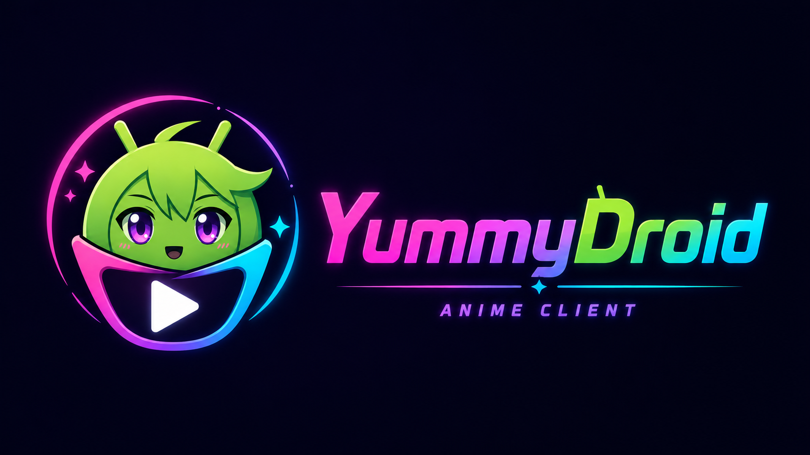

# YummyDroid

<p align="center">
  
</p>

<p align="center">
  <a href="https://github.com/saltek1995/YummyDroid/releases/latest">Последняя версия</a>
  ·
  <a href="https://api.yani.tv/swagger">API YummyAnime</a>
</p>

YummyDroid — неофициальный клиент YummyAnime для Android, Android TV, планшетов и ТВ-приставок.
Идея простая: открыть каталог, быстро найти нужное аниме, выбрать озвучку и смотреть в нормальном нативном плеере без лишней возни с браузером.

Приложение делается как универсальный клиент: один проект для телефона, планшета и телевизора, с адаптивным интерфейсом, поддержкой пульта, клавиатуры, мыши и сенсорного управления.

## Что Есть

**Каталог и навигация.**
Поиск, фильтры, сортировка, расписание и история просмотра собраны в одном интерфейсе. Каталог кэшируется, поэтому при переходах между разделами приложение не должно заново перетягивать уже загруженные данные без необходимости.

**Карточка аниме.**
В карточке собраны описание, данные о тайтле, кадры, трейлеры, порядок просмотра, серии, похожие аниме и комментарии. Жанры, год, студии и режиссеры можно использовать как быстрые переходы к фильтрам каталога.

**Аккаунт YummyAnime.**
После входа доступны метки, оценки, комментарии, подписки на озвучки и синхронизация прогресса просмотра. Приложение использует данные сайта, поэтому изменения должны быть видны на разных устройствах с одним аккаунтом.

**Плеер.**
Встроенный плеер выбирает рабочий источник, показывает доступные озвучки и качества, поддерживает PiP, автопереход к следующей серии, продолжение с нужного места и пропуск OP/ED по таймкодам, если они есть у серии.

**Оффлайн-просмотр.**
Серии можно скачивать в выбранной озвучке и качестве. Скачанные варианты привязываются к конкретной серии, поэтому при запуске приложение сначала проверяет локальный файл и только потом обращается к онлайн-источнику.

**Загрузки.**
Очередь загрузок работает в фоне, умеет ставить задачи на паузу, продолжать скачивание, показывать прогресс, скорость и размер файла. Для нестабильной сети предусмотрена докачка, чтобы не начинать большой файл заново после каждого сбоя.

**Домены и доступность.**
Приложение умеет работать с несколькими доменами YummyAnime и переключаться на доступный вариант, если текущий недоступен. Список доменов можно менять в настройках.

## Для Каких Устройств

YummyDroid рассчитан на:

- телефоны и планшеты Android;
- Android TV и ТВ-приставки;
- устройства с пультом, клавиатурой, мышью или сенсорным экраном;
- разные архитектуры Android-устройств, включая ARM и x86.

Интерфейс не делится на два разных приложения для телефона и телевизора. Он перестраивается под экран, ориентацию и способ управления.

## Установка

Актуальная подписанная сборка лежит в релизах:

https://github.com/saltek1995/YummyDroid/releases/latest

Скачайте APK из последнего релиза и установите его на устройство. В самом приложении также есть проверка обновлений через GitHub Releases.

## Разработка

Проект написан на Kotlin и использует Jetpack Compose для интерфейса и Media3/ExoPlayer для воспроизведения.

Для локальной проверки:

```powershell
.\gradlew.bat :app:testDebugUnitTest
```

Для сборки release APK:

```powershell
.\gradlew.bat :app:assembleRelease
```

## Статус

Проект активно развивается. Основной фокус сейчас — стабильное воспроизведение, корректная синхронизация с сайтом, надежные загрузки, удобный ТВ-интерфейс и аккуратная работа на разных размерах экранов.

YummyDroid не является официальным приложением YummyAnime.
