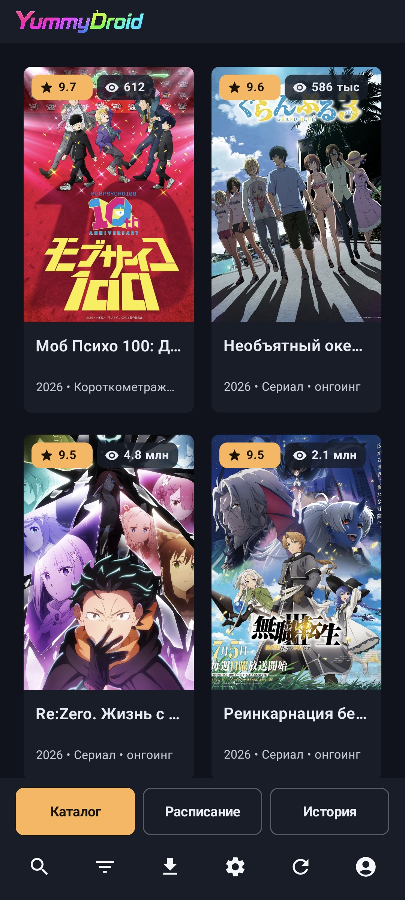
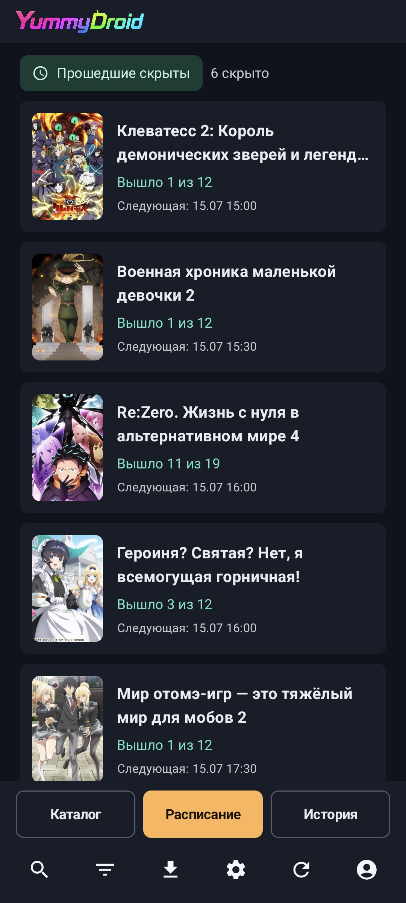
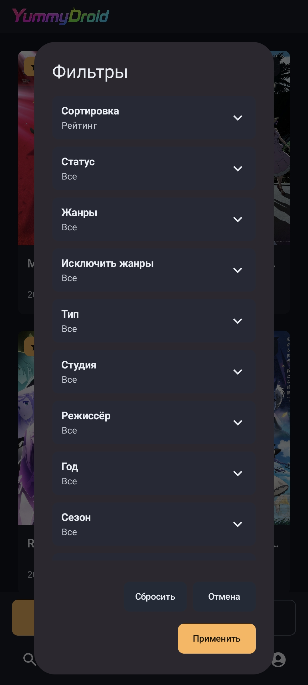
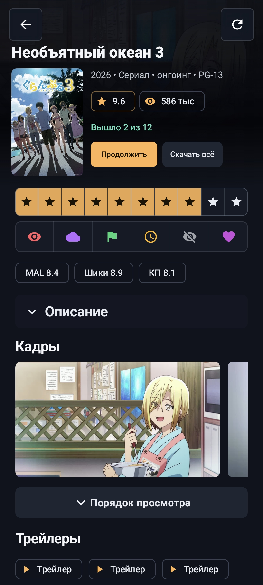
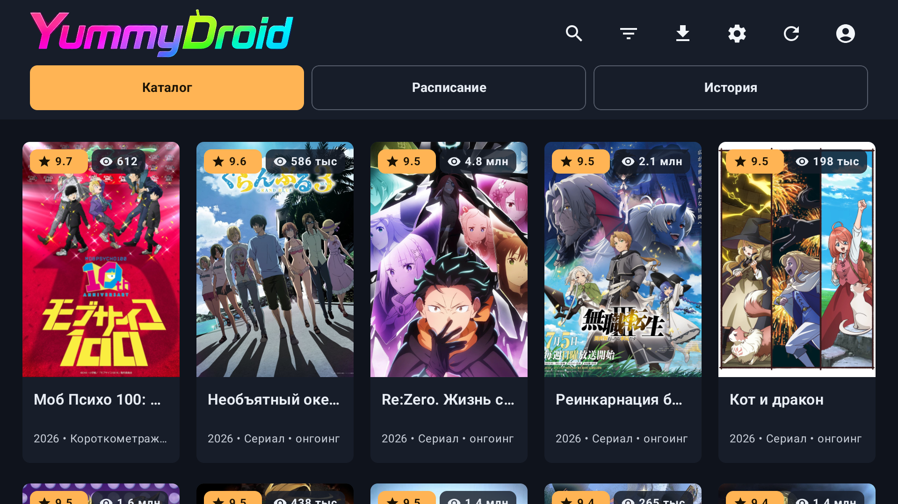
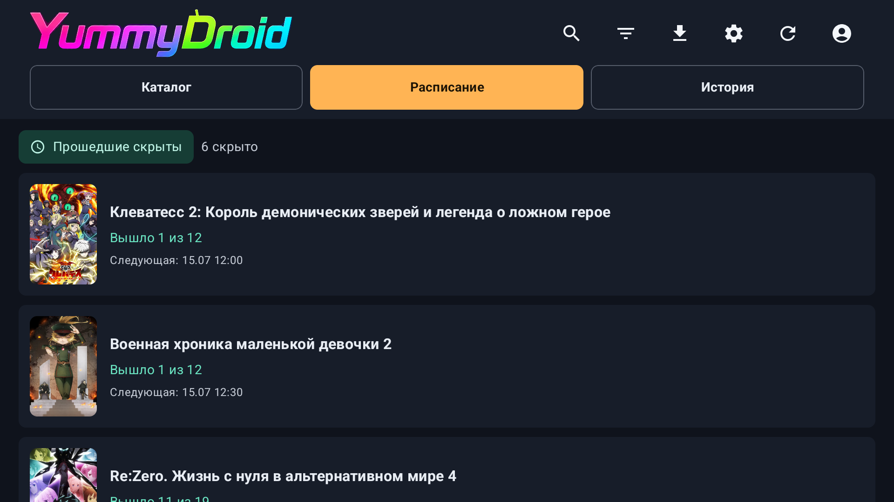
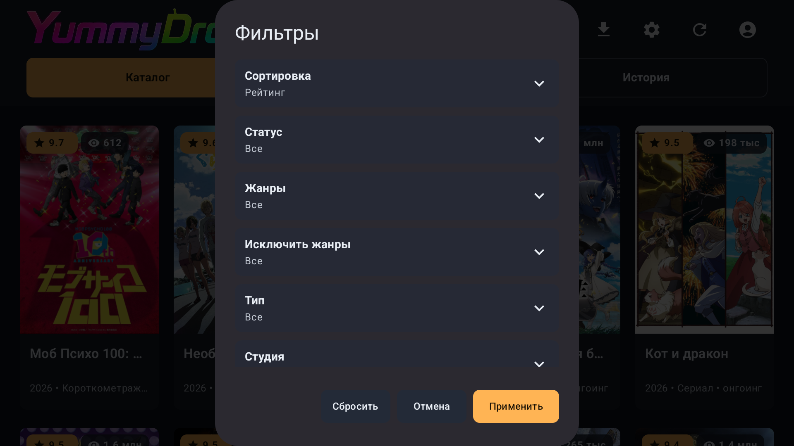
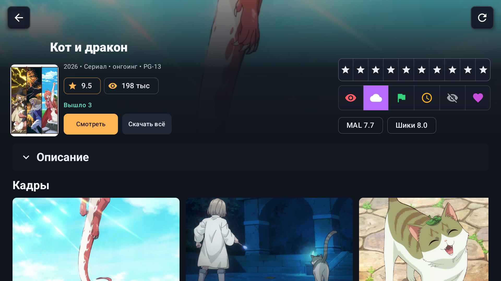

# YummyDroid

<p align="center">
  
</p>

<p align="center">
  <a href="https://github.com/saltek1995/YummyDroid/releases/latest">Последняя версия</a>
  ·
  <a href="https://api.yani.tv/swagger">API YummyAnime</a>
</p>

YummyDroid — неофициальный клиент YummyAnime для Android, Android TV, планшетов и ТВ-приставок.
Приложение сделано для обычного сценария просмотра: найти тайтл, открыть карточку, выбрать озвучку и смотреть в нативном плеере без браузера и лишних переходов.

Один и тот же клиент адаптируется под телефон, планшет и телевизор: сенсорное управление, пульт, клавиатура и мышь работают в общей логике интерфейса.

## Скриншоты

<details>
<summary>Мобильный вид</summary>

<p align="center">
  
  
  
  
</p>

</details>

<details>
<summary>ТВ-вид</summary>

<p align="center">
  
  
  
  
</p>

</details>

## Возможности

**Каталог.** Поиск, сортировка, фильтры, расписание и история просмотра собраны в одном интерфейсе. Уже загруженные страницы кэшируются, чтобы не перетягивать каталог заново при каждом переходе.

**Карточка аниме.** В карточке есть описание, данные о тайтле, кадры, трейлеры, порядок просмотра, серии, похожие аниме и комментарии. Жанры, год, студии и режиссеры можно использовать как быстрые переходы к фильтрам.

**Аккаунт YummyAnime.** После входа доступны метки, оценки, комментарии, подписки на озвучки и синхронизация прогресса просмотра. Данные берутся с сайта, поэтому изменения видны на разных устройствах с одним аккаунтом.

**Плеер.** Нативный плеер умеет выбирать рабочий источник, переключать озвучки и качество, продолжать просмотр с нужного места, работать в PiP, переходить к следующей серии и пропускать OP/ED по таймкодам.

**Оффлайн-просмотр.** Серии можно скачать в нужной озвучке и качестве. Скачанные файлы привязаны к конкретной серии, поэтому приложение запускает локальный вариант там, где он уже есть.

**Загрузки.** Очередь работает в фоне, показывает прогресс, скорость и размер файла, поддерживает паузу, продолжение и докачку после сетевых сбоев.

**Доступность сайта.** В приложении можно управлять списком доменов YummyAnime. Если текущий домен недоступен, клиент может переключиться на рабочий вариант.

## Установка

Актуальная подписанная сборка публикуется в GitHub Releases:

https://github.com/saltek1995/YummyDroid/releases/latest

Скачайте APK из последнего релиза и установите его на устройство. В приложении также есть проверка обновлений через GitHub.

## Разработка

Проект написан на Kotlin. Интерфейс построен на Jetpack Compose, воспроизведение — на Media3/ExoPlayer.

Проверка:

```powershell
.\gradlew.bat :app:testDebugUnitTest
```

Сборка release APK:

```powershell
.\gradlew.bat :app:assembleRelease
```

## Статус

Проект активно развивается. Основной фокус — стабильное воспроизведение, синхронизация с сайтом, надежные загрузки и аккуратная работа интерфейса на разных экранах.

YummyDroid не является официальным приложением YummyAnime.
