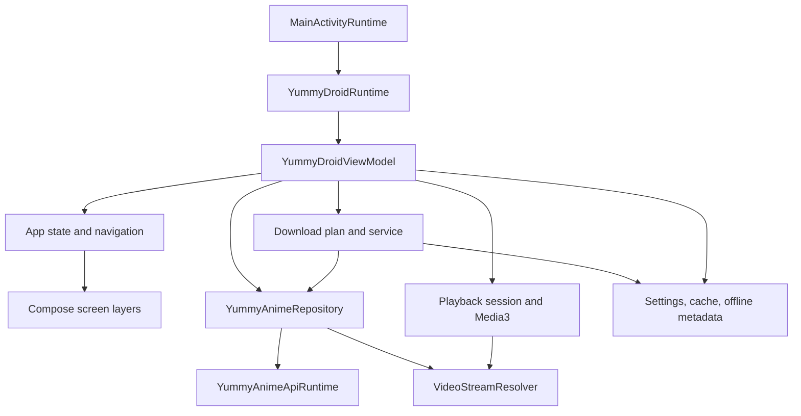

# ADR-0001: Application Ownership Boundaries

## Context

YummyDroid serves phone, tablet and TV layouts from one application while
coordinating network, storage, downloads, playback and D-pad focus. These
lifecycles must not acquire competing state owners as the project evolves.

## Decision

Code under `app/src/main/java/me/yummydroid/app` is organized around one
application runtime and one UI action/focus control path, with domain
coordinators owning asynchronous work and stale-result guards. Code under
`data/src/main/java/me/yummydroid/app/data` owns transport, persistence,
serialization and provider resolution. Compose code renders state and dispatches
actions; it does not become an alternate I/O or navigation owner. The ownership
map and behavioral invariants below are mandatory refactoring boundaries.

## Rationale

Central ownership makes cancellation, Back handling, focus relocation, fallback
state and optimistic rollback consistent across screens. Domain-specific
presentation and policy modules can evolve independently without duplicating
runtime controllers or coupling UI code to storage and network details.

## Consequences

- New behavior must be assigned to an existing owner or a clearly isolated
  domain coordinator.
- Cross-screen input and focus scheduling remain centralized; screens provide
  policy arguments instead of creating independent controllers.
- Large owners keep cohesive policies and coordinators in the same domain file;
  an additional production file requires an independent responsibility.
  Stable facades and runtime class names preserve callers and defect history.
- Git history records completed refactor steps; Repowise owns current metrics.

## Structural Constraints

1. Keep the production/indexed file count below 100.
2. Consolidate code by domain responsibility, not by equal file size.
3. Add a production file only when no existing owner can contain the behavior
   without mixing unrelated domains.
4. Tests stay under `src/test`; they are debug verification and are not shipped
   or included in the production health score.
5. Health measures the current code under `.repowise/health-rules.json`.
   On 2026-09-05 the owner explicitly authorized excluding Git-history signals
   from the 9+ target. Keep Git history intact and disable only those historical
   detectors; structural, duplication and error-handling findings remain active.
   Further production exclusions require an explicit change to this decision.

## Ownership Map

| Domain | Primary owners | Responsibility |
| --- | --- | --- |
| Android entry and system integration | `MainActivity.kt`, `YummyDroidApplicationRuntime.kt`, `YummyDroidRuntime.kt` | Activity lifecycle, input bridge, platform services, app-wide runtime wiring |
| State and navigation | `AppState.kt`, `AppNavigation.kt`, `YummyDroidViewModel.kt`, `ui/AppLayers.kt`, `ui/YummyDroidApp.kt`, `ui/DialogSupport.kt` | Stable UI facade, route state, layer stack, modal input and Back policy |
| Browse | `BrowseRuntime.kt`, `ui/BrowseHome.kt`, `ui/BrowseGrid.kt`, `ui/BrowsePager.kt`, `ui/BrowseFilters.kt`, `ui/BrowseSearch.kt`, `ui/ScheduleCalendar.kt` | Catalog, search, filters, schedule, paging, focus restoration, browse chrome |
| Anime details | `AnimeDetails.kt`, `ui/DetailsRuntime.kt`, `ui/DetailsContent.kt`, `ui/DetailsHero.kt`, `ui/DetailsComments.kt` | Details loading, account mark state, hero/actions, episodes, extras, comments, focus graph |
| Playback | `Playback.kt`, `PictureInPicture.kt`, `ui/NativePlayer.kt`, `ui/PlayerScreen.kt`, `ui/PlayerCore.kt`, `ui/PlayerControls.kt`, `ui/PlayerInput.kt`, `ui/PlayerMenus.kt`, `ui/PlayerTracks.kt` | Session and source coordination, Media3 lifecycle, controls, tracks, skip markers, PiP |
| Downloads | `DownloadCenter.kt`, `DownloadServiceRuntime.kt`, `DownloadPlan.kt`, `DownloadQueue.kt`, `DownloadMedia.kt`, `ui/DownloadPlan.kt`, `ui/DownloadScreen.kt`, `ui/DownloadSelection.kt` | Plan construction, queue/service state, source fallback, progress, pause/resume/cancel, download UI |
| Account and notifications | `AuthStateRuntime.kt`, `ProfileNotifications.kt`, `SubscriptionNotifications.kt`, `VideoSubscriptions.kt`, `WatchHistory.kt` | Profile state, subscriptions, notification sync, history and progress publication |
| Repository and API | `data/RepositoryData.kt`, `data/YummyAnimeApi.kt`, `data/YummyAnimeClient.kt`, `data/YummyAnimeContracts.kt`, `data/AnimeData.kt`, `data/FilterData.kt` | Public data boundary, HTTP API, DTO conversion, catalog and anime models |
| Streams and subtitles | `data/StreamResolvers.kt`, `data/PlaybackData.kt`, `data/SubtitleParsing.kt`, `data/SubtitleTracks.kt` | Provider resolution, request context, stream metadata, subtitle parsing and selection |
| Offline media | `data/DirectDownloads.kt`, `data/HlsDownloads.kt`, `data/OfflineData.kt` | Direct/HLS transfer mechanics, downloaded-file metadata and offline playback inputs |
| Settings and storage | `data/SettingsData.kt`, `data/LocalStorage.kt`, `ui/SettingsDialog.kt` | Persistent settings and caches, settings grouping, pickers and validation |
| Shared UI | `ui/UiEnvironment.kt`, `ui/UiLocalization.kt`, `ui/UiFeedback.kt`, `ui/VisualFocus.kt`, `ui/theme/*`, `ui/components/*` | Responsive environment, localized text, motion, focus policy, feedback and reusable surfaces |

Paths beginning with `data/` in the table are relative to
`data/src/main/java/me/yummydroid/app/`; UI paths are relative to
`app/src/main/java/me/yummydroid/app/`.

## Runtime Flow



The ViewModel is the stable UI facade. Coordinators inside the application
domain own asynchronous jobs and stale-result guards. Repository and resolver
code owns network, parsing and provider behavior. Compose renders state and
dispatches actions; it must not become an alternate I/O owner.

## Behavioral Invariants

### Platform and layout

- Manifest services, receivers, activities, providers and WorkManager workers
  are runtime entry points even when a static import graph reports them unused.
- Phone, tablet and TV classification uses unscaled device/window geometry.
  Reducing UI scale must never switch a portrait phone into the TV layout.
- App typography is normalized independently of Android system font scaling.
- UI scale remains bounded to 50-130 percent in 10-percent steps.
- Offline mode renders one interaction model for the active device class; phone
  and TV navigation chrome must not appear together.

### Navigation and focus

- `AppNavigationController` in `ui/VisualFocus.kt` owns application input,
  active modal/player adapters, focus scopes and cancellable UI operations.
  `MainActivityInputRouter` only translates Android events; `AppNavigationBinding`
  connects the controller to route actions. Neither introduces another mutable
  navigation owner. Screens declare policies through `navigationKeyPolicy`.
- Compose focus targets register inside `navigationFocusBoundary`; dialogs and
  inline overlays have their own scope. Disabled, inactive and detached targets
  cannot receive traversal. Native player keys use the same normalized actions,
  without per-button key listeners or a second platform focus search.
- Left/Right traverse the current visual row using live layout coordinates.
  Reflow, scaling, translation and orientation changes invalidate assumed rows.
  Up/Down visit the next row, including a partially filled final grid row.
  Explicit episode paging and browse-section changes at horizontal grid edges
  remain intentional page transitions (confirmed by the owner on 2026-09-06).
- Every vertical scroll container declares `navigationScrollRegion` (or uses
  `navigationVerticalScroll`). With no further focus target, Up/Down scroll the
  remaining content to its actual edge without changing focus. Nested regions
  drain from inside out; a dialog can never scroll the background page.
- Text-field Left/Right belong to cursor editing only while that field is focused
  and the IME is visible. Otherwise they navigate between controls. Space remains
  text input. Sliders retain Left/Right value adjustment and Up/Down traversal.
- One consumed key-down owns its matching key-up. Repeated media toggles cannot
  execute twice; joystick directions follow the same dispatch path as D-pad keys.
- Registration cleanup may remove only its own modal/player adapter. Delayed
  focus materialization is invalidated by pointer input or a layer/modal change.
  Popup dismissal restores its anchor synchronously before another key can arrive.
- Back closes the top modal before changing a route or leaving the app.
- Returning from details restores the exact catalog item and its visual focus,
  not the first item in the preceding row.
- Touch, keyboard and D-pad use the same action model. Focus request retries must
  stop when touch input is active.
- Responsive decisions use stable dimensions so text, badges and controls do not
  resize or overlap when content changes.
- Catalog and schedule columns also respect the actual scaled content width after
  padding and gaps; increased scale must not truncate numeric card badges.
- Schedule episode numbers may include zero. Captions describe the episode number,
  not an inferred count of released episodes.
- Catalog, history and schedule warm one viewport of posters beyond the visible
  rows, using actual grid dimensions and excluding calendar/footer items. The
  catalog requests its next data page before that buffer runs out. One image
  worker shares the visible cards' decode size/cache key and skips obsolete work;
  inactive screens stop prefetch and offline image policy is preserved.

### Playback

- A player route has one session owner. Its Cast wrapper, when present, also
  releases the local player; the local instance must not be released twice.
  Removed player routes never enter the separately composed exit-animation list.
  Loading and ready presentations reuse one native view tree until geometry changes.
- A manual quality selection, including Auto, overrides the global default for
  subsequent episodes of that anime during the current app process. Local files
  use the same quality fallback ordering as online playback.
- Provider, voice, episode and quality selection operate on canonical video
  variants and shared matching helpers.
- Automatic fallback updates both the active stream and the provider shown by
  the UI. The displayed source must describe the stream actually in use.
- Initial playback and source replacement use the same aspect-ratio policy.
  Changing source, quality or voice must not be required to correct video scale.
- Player controls adapt to shallow and unusual aspect ratios without stretching
  across the whole surface or covering the video.
- Replacing a stream may recreate the Media3 surface, but it must preserve player
  chrome state, position, selected tracks and skip-control behavior.
- Alloha requests retain the resolver's cookies, referer/origin and request
  context through Media3; browser success must not degrade into an app-only 403.

### Downloads and offline data

- New plans choose exactly one voice, one source and one quality, in the order
  voice -> source -> episodes -> quality. Probe one selected episode only after
  the first three steps. Returning to the same selection reuses its result.
- The selected source is persisted with plan items and restricts both batch and
  individual resume/fallback. Existing saved plans retain their stored priorities.
- Source fallback updates the persisted task and visible source immediately; the
  queue must never keep showing a failed initial provider after switching.
- Download rows use localized episode/source/voice text and never expose mojibake.
- Pause, resume, cancel, retry and process restart preserve queue and summary
  consistency. Foreground-service notification state follows the same task state.
- Intermediate transfer progress is published at most four times per second per
  attempt. Source/voice/quality changes and completion bypass that interval. Reads,
  cancellation checks and terminal task transitions remain immediate; resume
  offsets continue to come from the actual partial file.
- After process interruption, queued/running work is distinct from a manual pause.
  Opening the app resumes eligible work through batch summaries once, subject to
  network settings. An Android-rejected start must retain the previous queue state.
- A delivered resume command must still refer to an existing runnable queue entry;
  clearing/removing an entry prevents an older resume intent from recreating it.
- A plan child is identified by plan and episode, independent of provider video ID.
  Resuming through a different provider reuses its row and updates source metadata.
- Direct downloads validate response offsets before appending. HTTP 416 only
  completes a partial file when the server confirms its exact final size.
- Completed media replaces its destination atomically. An absent replacement must
  not delete an existing valid artifact.
- Downloaded media remains tied to anime, episode, voice, quality and actual
  provider so offline playback can select the correct file.

- Cache cleanup cancels and drains queued commands and actual writers before
  clearing the queue, saved plans and files. The transaction finishes even when
  its initiating screen closes. New commands wait for maintenance to finish.
- The APK update writer participates in cache maintenance. Partial downloads never
  replace a valid APK, and cancelled/superseded requests cannot launch installation.
- Android foreground-service timeouts stop the foreground service promptly and
  drain its work. Active episode tasks become interrupted, preserving progress
  for the approved next-open resume; manual pauses remain manual pauses.
- Batch results distinguish cancellations from failures. Completed/cancelled
  episodes leave the retry plan; unavailable requested episodes remain errors.
- Deleting an anime/episode cancels only related work, excludes that episode from
  active and persisted plans, and preserves unrelated downloads. Source variants
  are matched by episode identity as well as video ID.
- One live concurrency limiter applies settings to ordinary and batch downloads.
  Lowering the limit lets existing writers finish; increasing it admits waiters.
- A download-source HTTP 403 suspends that provider across the queue for five
  minutes, persisted across restarts. Try alternatives first; otherwise wait without
  holding a writer slot or consuming an error retry. Pause/cancel/network policy
  remains active during waiting. Do not stress real providers to test this branch.
- Provider cooldown propagates through resolver and manifest fallbacks immediately;
  it must not invalidate a healthy catalog domain or become missing metadata.
- Offline indexes and content/source-quality caches have shared ownership across
  repository instances. A completed artifact remains protected until indexed;
  JSON replacement never exposes a partially written document. Image caches are
  cleared through Coil rather than deleting its live journal behind its back.


### Data and concurrency

- Network, disk, manifest parsing and stream resolution stay off the main thread.
- Coroutine-owned HTTP reads close their call on cancellation and drain the reader
  before returning, including body reads and writes that follow response headers.
- Cancellation propagates. A cancelled request is not converted into stale empty
  data or applied to a newer route/session.
- Explicit logout and rejected/restored-missing authentication share session
  cleanup: cancel account operations before clearing profile state, then reload
  guest content after credentials are cleared. A network failure alone retains
  the cached profile. Local downloads and watch progress survive logout.
- A successful login publishes token and profile together. Background session
  refreshes and rejection cleanup compare the expected token; notification counts
  update only their field for the active profile, never rewrite an old profile.
- Optimistic account mutations retain the exact previous state for rollback.
  Notification reads and edits share one queue so a stale refresh cannot replace
  a pending edit; system notification state follows backend confirmation.
- Comment submission has one pending operation state. Keep its draft on failure,
  clear only the acknowledged text on success, and reject duplicate pending sends.
  Editing a draft during sending must preserve the new text. Completion and captcha
  retries remain bound to the original account/anime; logout invalidates old work.
- Background notification results belong to the token/profile captured before the
  request. Session validation and local publication/cleanup are one transaction.
  Notification initialization, seen events and unread snapshots belong to an account;
  switching accounts cannot transfer or erase another account's history.
- Cache fallback may serve stale data only where the owning coordinator explicitly
  allows it and must preserve the online follow-up load.
- Content requests retain their original account/language and cache generation.
  Late responses cannot populate another account/language or recreate cleared data.
- Offline fallback belongs to each content response, not a repository-wide mutable
  flag. Concurrent catalog/details requests cannot change each other's origin.
- Connectivity belongs to AppContentRefreshRuntime and the current application
  state, never to cached routes. A cached response cannot exit offline mode.
  Network loss cancels remote detail/history/stream metadata work; recovery must
  confirm site reachability before enabling online operations again. Offline
  playback resolves local files directly and never probes providers or subtitles.
- Offline storage publishes a durable revision after media changes. Details merge
  the latest local snapshot into every new/restored video list; queue task removal
  must not lose a completion or require refetching remote anime metadata.
- Subtitle cache cleanup and publication share a generation guard, including late
  JavaScript/WebView captures. WebView intercepted HTTP calls belong to the capture
  session and are cancelled/drained when it ends. Relevant native WebView 403s also
  enter the download provider cooldown.
- Settings decode one preference snapshot with typed fallbacks. A malformed field
  cannot prevent startup or erase otherwise valid settings.
- AppSettingsRuntime is the single settings writer. Persist the complete snapshot;
  Activity recreation observes the saved language/scale and compares them with
  the configuration attached to that Activity. Screens must not write individual
  preferences or recreate from an intermediate, unsaved snapshot.

## Refactor Procedure

1. Query Repowise context, risk and health for the intended owner.
2. Characterize branch order, fallback order and boundary values in an existing
   test file before changing behavior-heavy code.
3. Refactor one domain responsibility per commit. Tests may accompany the owner,
   but unrelated production files must not be bundled into the same commit.
4. Prefer a private policy/result type when several UI or runtime branches derive
   from the same inputs. Keep one source of truth for those decisions.
5. Reuse an existing domain owner before creating another file. Do not merge code
   merely to reduce file count when the result would mix unrelated lifecycles.
6. Recalculate health after the commit. A clean build without a measurable design
   improvement is verification, not proof that the refactor helped.

## Verification Matrix

| Change area | Required evidence |
| --- | --- |
| Pure selector, formatter or policy | Focused unit tests for every branch and boundary |
| Browse/details focus or Back | Existing focus/navigation scenarios plus full `check` |
| Player source, tracks or geometry | Player unit tests, full `check`, then an isolated runtime check when explicitly required |
| Download plan or service | Plan/source/task tests, full `check`, and release compilation for a requested release |
| Storage or serialization | Round-trip, migration and malformed-input tests plus full `check` |
| Manifest/runtime entry point | Manifest inspection, compile/lint and a runtime check where available |
| Release | Clean tree, full `check`, `assembleRelease`, APK version/hash verification, tagged push and empty release body |

The project-wide gate is:

```powershell
.\gradlew.bat check --no-build-cache --console=plain
```

Runtime player checks must always exit the player before the verification session
ends. A runtime check must never leave video playing on an emulator or device.
