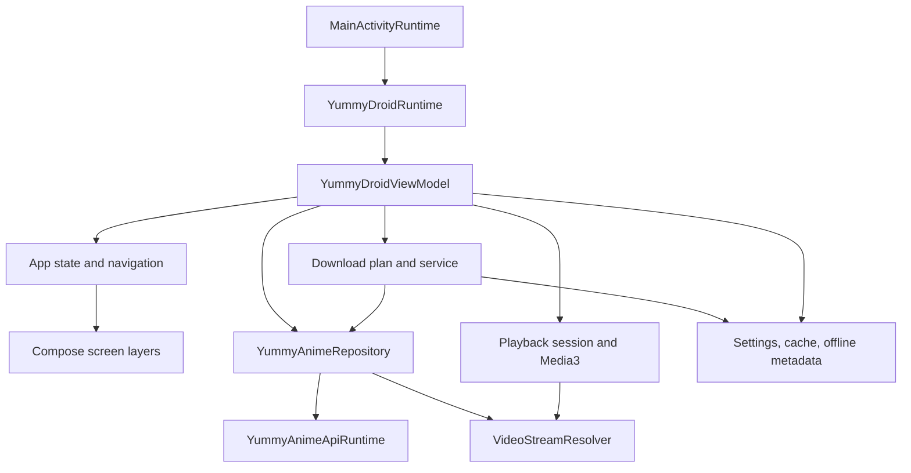

# ADR-0001: Application Ownership Boundaries

## Context

YummyDroid serves phone, tablet and TV layouts from one application while
coordinating network, storage, downloads, playback and D-pad focus. These
lifecycles must not acquire competing state owners as the project evolves.

## Decision

Code under `app/src/main/java/me/yummydroid/app` is organized around one
application runtime and one UI action/focus control path, with domain
coordinators owning asynchronous work and stale-result guards. Code under
`data/src/main/java/me/yummydroid/app/data` owns transport, persistence,
serialization and provider resolution. Compose code renders state and dispatches
actions; it does not become an alternate I/O or navigation owner. The ownership
map and behavioral invariants below are mandatory refactoring boundaries.

## Rationale

Central ownership makes cancellation, Back handling, focus relocation, fallback
state and optimistic rollback consistent across screens. Domain-specific
presentation and policy modules can evolve independently without duplicating
runtime controllers or coupling UI code to storage and network details.

## Consequences

- New behavior must be assigned to an existing owner or a clearly isolated
  domain coordinator.
- Cross-screen input and focus scheduling remain centralized; screens provide
  policy arguments instead of creating independent controllers.
- Large owners are split by responsibility while their stable facade remains in
  place, preserving callers and defect history.
- Git history records completed refactor steps; Repowise owns current metrics.

## Structural Constraints

1. Keep the production/indexed file count below 100.
2. Consolidate code by domain responsibility, not by equal file size.
3. Add a production file only when no existing owner can contain the behavior
   without mixing unrelated domains.
4. Tests stay under `src/test`; they are debug verification and are not shipped
   or included in the production health score.
5. Do not suppress or exclude production findings to raise the score. Resolve
   the underlying design or leave the finding visible.

## Ownership Map

| Domain | Primary owners | Responsibility |
| --- | --- | --- |
| Android entry and system integration | `MainActivity.kt`, `MainActivityRuntime.kt`, `YummyDroidApplicationRuntime.kt`, `YummyDroidRuntime.kt` | Activity lifecycle, input bridge, platform services, app-wide runtime wiring |
| State and navigation | `AppState.kt`, `AppNavigation.kt`, `YummyDroidViewModel.kt`, `ui/AppLayers.kt`, `ui/YummyDroidApp.kt`, `ui/YummyDroidAppInput.kt`, `ui/DialogSupport.kt` | Stable UI facade, route state, layer stack, modal input and Back policy |
| Browse | `BrowseRuntime.kt`, `ui/BrowseHome.kt`, `ui/BrowseChrome.kt`, `ui/BrowseTopChrome.kt`, `ui/BrowseGrid.kt`, `ui/BrowseNavigation.kt`, `ui/BrowsePager.kt`, `ui/BrowseFilters.kt`, `ui/BrowseSearch.kt`, `ui/BrowseSchedule.kt`, `ui/ScheduleCalendar.kt`, `ui/ScheduleCalendarPresentation.kt` | Catalog, search, filters, schedule, paging, focus restoration, browse chrome |
| Anime details | `AnimeDetails.kt`, `ui/DetailsRuntime.kt`, `ui/DetailsContent.kt`, `ui/DetailsHero.kt`, `ui/DetailsHeroMetadata.kt`, `ui/DetailsHeroRatings.kt`, `ui/DetailsFocus.kt`, `ui/DetailsComments.kt` | Details loading, account mark state, hero/actions, episodes, extras, comments, focus graph |
| Playback | `Playback.kt`, `PictureInPicture.kt`, `ui/NativePlayer.kt`, `ui/PlayerScreen.kt`, `ui/PlayerShell.kt`, `ui/PlayerPresentation.kt`, `ui/PlayerCore.kt`, `ui/PlayerControls.kt`, `ui/PlayerInput.kt`, `ui/PlayerMenus.kt`, `ui/PlayerTracks.kt` | Session and source coordination, Media3 lifecycle, controls, tracks, skip markers, PiP |
| Downloads | `DownloadCenter.kt`, `DownloadPlan.kt`, `DownloadQueue.kt`, `DownloadMedia.kt`, `ui/DownloadPlan.kt`, `ui/DownloadScreen.kt`, `ui/DownloadSelection.kt` | Plan construction, queue/service state, source fallback, progress, pause/resume/cancel, download UI |
| Account and notifications | `ProfileNotifications.kt`, `SubscriptionNotifications.kt`, `VideoSubscriptions.kt`, `VideoSubscriptionActions.kt`, `WatchHistory.kt` | Profile state, subscriptions, notification sync, history and progress publication |
| Repository and API | `data/RepositoryData.kt`, `data/YummyAnimeApi.kt`, `data/YummyAnimeClient.kt`, `data/YummyAnimeContracts.kt`, `data/YummyAnimeServices.kt`, `data/AnimeData.kt`, `data/FilterData.kt` | Public data boundary, HTTP API, DTO conversion, catalog and anime models |
| Streams and subtitles | `data/StreamResolvers.kt`, `data/PlaybackData.kt`, `data/SubtitleParsing.kt`, `data/SubtitleTracks.kt` | Provider resolution, request context, stream metadata, subtitle parsing and selection |
| Offline media | `data/DirectDownloads.kt`, `data/HlsDownloads.kt`, `data/OfflineData.kt` | Direct/HLS transfer mechanics, downloaded-file metadata and offline playback inputs |
| Settings and storage | `data/SettingsData.kt`, `data/LocalStorage.kt`, `ui/SettingsDialog.kt` | Persistent settings and caches, settings grouping, pickers and validation |
| Shared UI | `ui/UiEnvironment.kt`, `ui/UiLocalization.kt`, `ui/UiFeedback.kt`, `ui/VisualFocus.kt`, `ui/theme/*`, `ui/components/*` | Responsive environment, localized text, motion, focus policy, feedback and reusable surfaces |

Paths beginning with `data/` in the table are relative to
`data/src/main/java/me/yummydroid/app/`; UI paths are relative to
`app/src/main/java/me/yummydroid/app/`.

## Runtime Flow



The ViewModel is the stable UI facade. Coordinators inside the application
domain own asynchronous jobs and stale-result guards. Repository and resolver
code owns network, parsing and provider behavior. Compose renders state and
dispatches actions; it must not become an alternate I/O owner.

## Behavioral Invariants

### Platform and layout

- Manifest services, receivers, activities, providers and WorkManager workers
  are runtime entry points even when a static import graph reports them unused.
- Phone, tablet and TV classification uses unscaled device/window geometry.
  Reducing UI scale must never switch a portrait phone into the TV layout.
- App typography is normalized independently of Android system font scaling.
- UI scale remains bounded to 50-130 percent in 10-percent steps.
- Offline mode renders one interaction model for the active device class; phone
  and TV navigation chrome must not appear together.

### Navigation and focus

- Back closes the top modal before changing a route or leaving the app.
- Returning from details restores the exact catalog item and its visual focus,
  not the first item in the preceding row.
- Touch, keyboard and D-pad use the same action model. Focus request retries must
  stop when touch input is active.
- Responsive decisions use stable dimensions so text, badges and controls do not
  resize or overlap when content changes.

### Playback

- Provider, voice, episode and quality selection operate on canonical video
  variants and shared matching helpers.
- Automatic fallback updates both the active stream and the provider shown by
  the UI. The displayed source must describe the stream actually in use.
- Initial playback and source replacement use the same aspect-ratio policy.
  Changing source, quality or voice must not be required to correct video scale.
- Player controls adapt to shallow and unusual aspect ratios without stretching
  across the whole surface or covering the video.
- Replacing a stream may recreate the Media3 surface, but it must preserve player
  chrome state, position, selected tracks and skip-control behavior.
- Alloha requests retain the resolver's cookies, referer/origin and request
  context through Media3; browser success must not degrade into an app-only 403.

### Downloads and offline data

- A plan preserves voice priority, quality priority and source-provider priority.
- Source fallback updates the persisted task and visible source immediately; the
  queue must never keep showing a failed initial provider after switching.
- Download rows use localized episode/source/voice text and never expose mojibake.
- Pause, resume, cancel, retry and process restart preserve queue and summary
  consistency. Foreground-service notification state follows the same task state.
- Downloaded media remains tied to anime, episode, voice, quality and actual
  provider so offline playback can select the correct file.

### Data and concurrency

- Network, disk, manifest parsing and stream resolution stay off the main thread.
- Cancellation propagates. A cancelled request is not converted into stale empty
  data or applied to a newer route/session.
- Optimistic account mutations retain the exact previous state for rollback.
- Cache fallback may serve stale data only where the owning coordinator explicitly
  allows it and must preserve the online follow-up load.

## Refactor Procedure

1. Query Repowise context, risk and health for the intended owner.
2. Characterize branch order, fallback order and boundary values in an existing
   test file before changing behavior-heavy code.
3. Refactor one domain responsibility per commit. Tests may accompany the owner,
   but unrelated production files must not be bundled into the same commit.
4. Prefer a private policy/result type when several UI or runtime branches derive
   from the same inputs. Keep one source of truth for those decisions.
5. Reuse an existing domain owner before creating another file. Do not merge code
   merely to reduce file count when the result would mix unrelated lifecycles.
6. Recalculate health after the commit. A clean build without a measurable design
   improvement is verification, not proof that the refactor helped.

## Verification Matrix

| Change area | Required evidence |
| --- | --- |
| Pure selector, formatter or policy | Focused unit tests for every branch and boundary |
| Browse/details focus or Back | Existing focus/navigation scenarios plus full `check` |
| Player source, tracks or geometry | Player unit tests, full `check`, then an isolated runtime check when explicitly required |
| Download plan or service | Plan/source/task tests, full `check`, and release compilation for a requested release |
| Storage or serialization | Round-trip, migration and malformed-input tests plus full `check` |
| Manifest/runtime entry point | Manifest inspection, compile/lint and a runtime check where available |
| Release | Clean tree, full `check`, `assembleRelease`, APK version/hash verification, tagged push and empty release body |

The project-wide gate is:

```powershell
.\gradlew.bat check --no-build-cache --console=plain
```

Runtime player checks must always exit the player before the verification session
ends. A runtime check must never leave video playing on an emulator or device.
