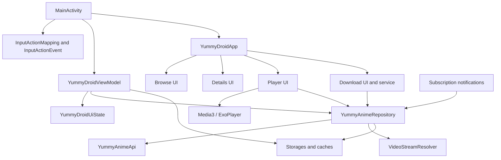
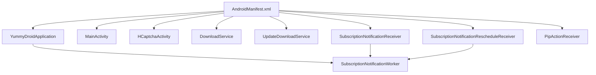
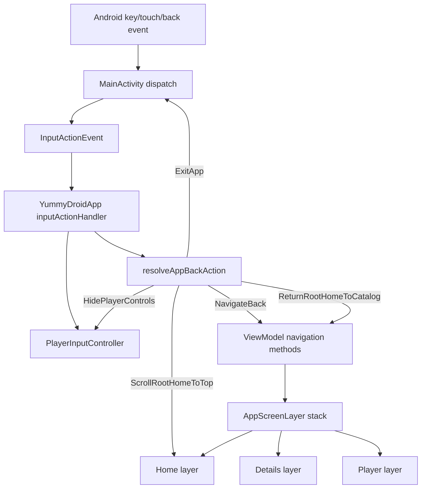
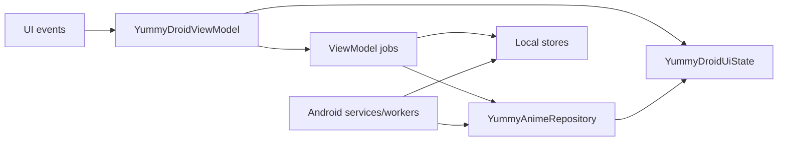
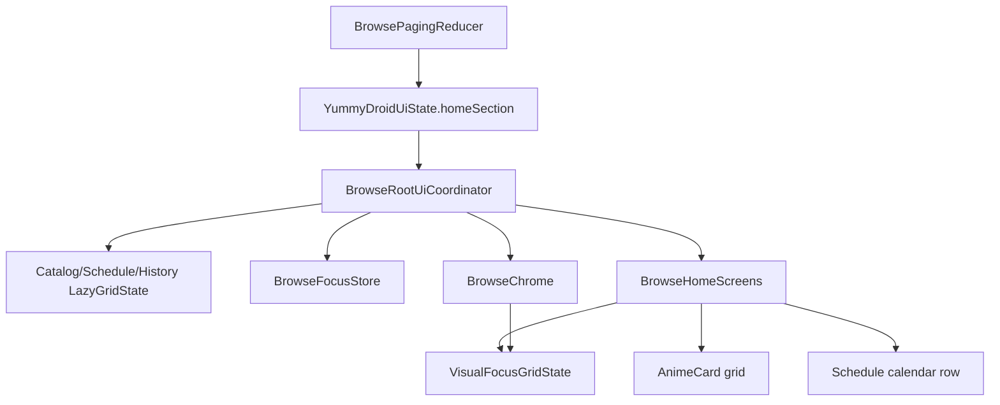
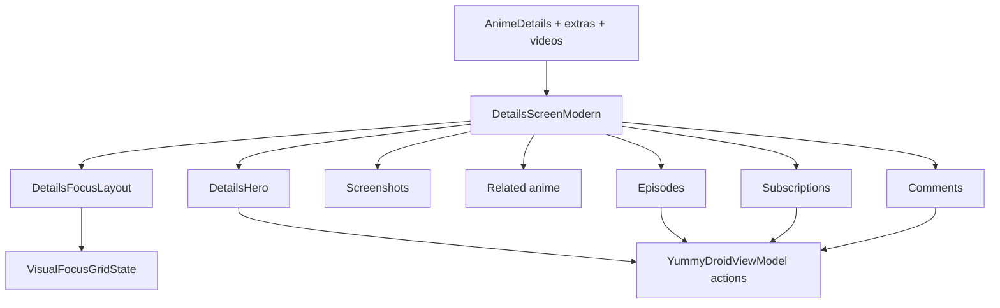
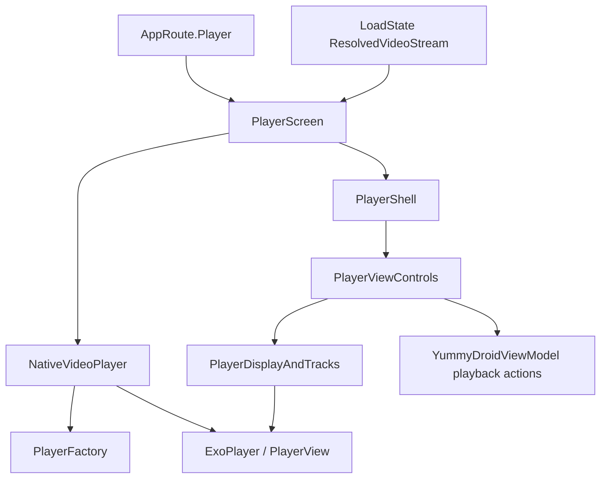
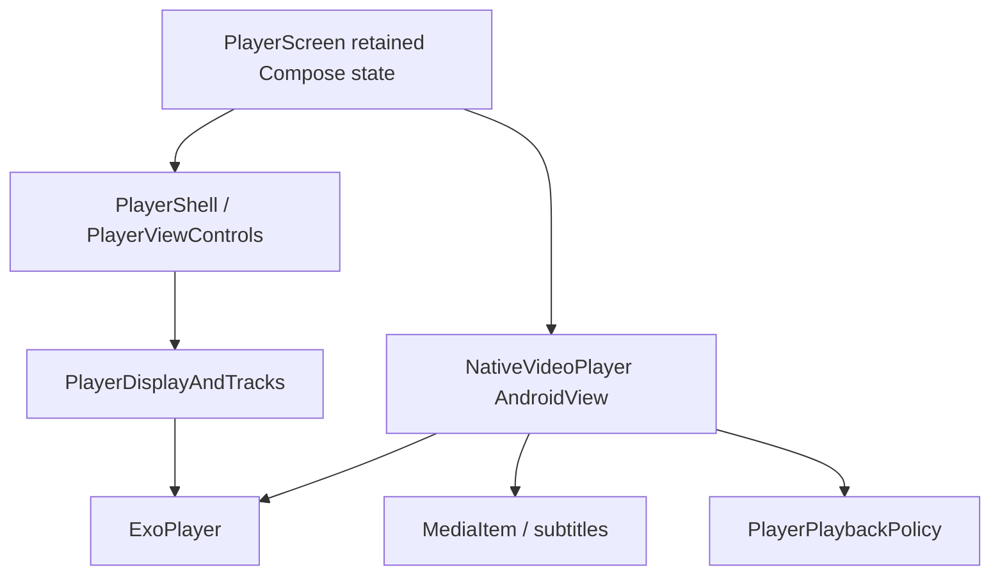
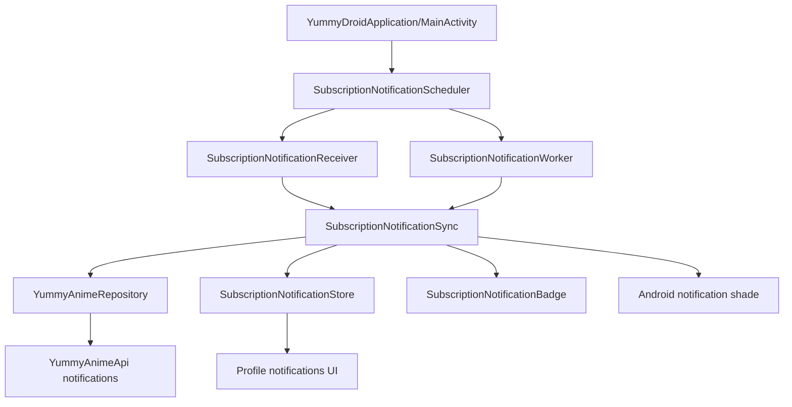
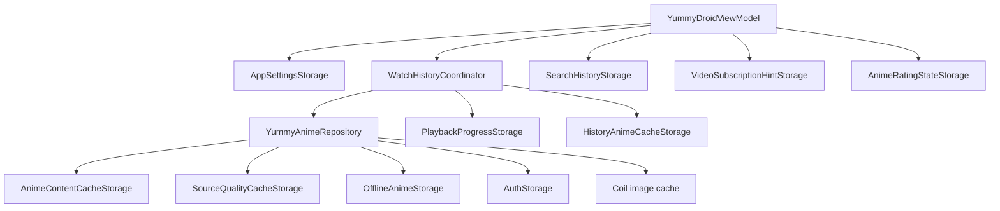

# YummyDroid Refactor Logic Map

Generated during the refactor pass from repowise orientation plus local source inspection.
This file is intentionally behavioral: it maps what must keep working while cleanup,
consolidation, and performance work happens.

## Refactor Rules

1. Preserve observable behavior unless a task explicitly asks to change it.
2. Do not delete Android entry points just because the import graph marks them unused.
   Manifest receivers, services, application classes, FileProvider config, serializers,
   and reflection-loaded classes need runtime evidence before removal.
3. UI changes must go through the shared UI control points instead of adding competing
   per-screen focus, scroll, tab, or back logic.
4. Video availability, voice/source/quality selection, subtitles, playback, and downloads
   must use canonical `/anime/{id}/videos` data and shared matching helpers.
5. Heavy work stays off the main thread. Compose code should render state and dispatch
   events; network, disk, parsing, resolving, and cache calculation belong in data/app
   background boundaries.
6. Player chrome and video playback are separate layers: chrome state should survive
   video source replacement, while the Media3 surface may be recreated when needed.

## Top-Level Module Graph



## Current Repowise Health Snapshot

Captured before this refactor pass from the indexed `ad69858` tree.

- Repository size: 134 source files, about 47k lines.
- Overall health band: `alert`; weighted average health: 3.32.
- Import cycles: 2.
- Highest leverage files by repowise weighted gap:
  `VideoStreamResolver`, `YummyDroidViewModel`, `BrowseHomeScreens`,
  `BrowseChrome`, `AccountSettingsDialogs`, `YummyAnimeRepository`,
  `PlayerViewControls`, `DownloadService`.
- Static dead-code findings must be treated as candidates, not facts.
  Android manifest classes, WorkManager workers, receivers, Application classes,
  serializers, and popup/Compose entry points can look unused to an import graph
  while still being runtime-loaded.

Cleanup rule for this pass:
- Prefer extracting pure helpers and local contracts inside hot files.
- Do not delete subtitle, video matching, download selection, notification, or
  manifest-related symbols unless compile-time references, tests, and runtime
  entry registration all agree they are dead.
- Do not split provider-specific playback code into new provider modules until
  there are per-provider tests for Alloha, CVH, Kodik, subtitles, manifests,
  and quality maps.

## Runtime Entry Point Graph



Static cleanup implication:
- These symbols are not safe to remove just because no Kotlin import points at
  them. Their owner is Android runtime registration.

## App Shell, Layers, and Back



Central owners:
- `MainActivity`: Android event bridge, PiP, system bars, activity intents.
- `YummyDroidApp`: screen layer composition, modal routing, input delegation.
- `AppBackHandling`: pure priority policy for Back.
- `DetailsMediaAndLayers`: layer retention and details screen state.

Refactor boundary:
- Back policy is pure and testable. Keep it in `AppBackHandling`.
- Screen state retention belongs to layer state, not to ad hoc focus restoration.
- Do not add screen-specific Back branches when a shared state predicate can represent it.

## App State Ownership Graph



Ownership rules:
- `YummyDroidViewModel` owns user-visible state transitions and optimistic UI.
- `YummyAnimeRepository` owns network/cache/offline orchestration.
- Services/workers own background execution and report back through stores or
  notifications, not by mutating Compose state.
- UI files should not duplicate repository matching rules; they should render
  data already normalized by shared data helpers.

## Browse Root UI Graph



Central owners:
- `BrowseRootUiCoordinator`: section grid states, stored focused index, topbar progress.
- `BrowsePagingReducer`: request identity, reset/load-more paging transitions, stale-result
  rejection, catalog route cache snapshots, and offline fallback state.
- `BrowseGridFocusController`: grid focus movement plus scroll positioning.
- `VisualGridNavigation`: visual-direction focus target selection across irregular blocks.
- `BrowseChrome`: root action buttons, tabs, glass/chrome visuals.
- `BrowseHomeScreens`: section content, schedule calendar, paging, dpad hooks.

Known consolidation target:
- Topbar/chrome visibility and protected scroll bounds must be a single contract consumed
  by Catalog, History, and Schedule.
- D-pad fallback focus must use one root recovery path, not per-section fixes.
- Schedule-specific calendar navigation should expose its real visual focus nodes to
  `VisualGridNavigation` instead of bypassing it with competing key logic.

## Details UI Graph



Central owners:
- `DetailsScreenUiState`: retained scroll/expanded/focus state.
- `DetailsFocusLayout`: block offsets and node counts.
- `DetailsHero`, `DetailsSections`, `DetailsMediaAndLayers`: UI blocks.

Refactor boundary:
- Focus block counts must stay consistent with rendered focus items.
- State should stay in the retained details layer when navigating details to details.
- Description counters and API descriptive fields must not be recalculated from videos.

## Player Graph



Central owners:
- `PlayerScreen`: player-level Compose state, loading/error/resume dialogs, retained ready playback.
- `NativeVideoPlayer`: Media3 player/view lifecycle, MediaItem replacement, playback callbacks.
- `PlayerShell`: Android `PlayerView` shell, source labels, subtitle references.
- `PlayerViewControls`: control layout, menus, skip controls, focus.
- `PlayerDisplayAndTracks`: quality/subtitle track extraction and labels.

Refactor boundary:
- Player chrome should not be recreated just because video stream/source changes.
- Menus and buttons must stay visible; disabled state replaces hidden state except PiP support.
- Subtitle labels and subtitle presence must come from actual resolved/media tracks, not guessed
  by provider name.
- Auto fallback must be driven by real playback failure/buffering policy, not source churn.

## Player Internal Ownership Graph



Refactor rule:
- Chrome/UI state and Media3 lifecycle state must stay separate. Pure policies
  can be extracted, but listener ordering, `setMediaItem`, `prepare`, subtitle
  configuration, and player release paths need runtime playback checks.

## Video, Source, Quality, and Downloads

```mermaid
flowchart TD
    DetailsVideos[/anime id videos]
    VideoMatching[VideoMatching]
    DownloadSelection[VideoDownloadSelection]
    DownloadPlan[DownloadPlan]
    Repository[YummyAnimeRepository]
    Resolver[VideoStreamResolver]
    Quality[QualitySelection]
    SourceCache[SourceQualityCacheStorage]
    Player[Player stream]
    DownloadService[DownloadService]
    Offline[OfflineAnimeStorage]

    DetailsVideos --> VideoMatching
    DetailsVideos --> DownloadSelection
    VideoMatching --> DownloadPlan
    DownloadSelection --> DownloadPlan
    DownloadPlan --> DownloadService
    Repository --> Resolver
    Resolver --> Quality
    Resolver --> SourceCache
    Repository --> Player
    Repository --> DownloadService
    DownloadService --> Offline
```

Central owners:
- `VideoMatching`: identity and grouping for episode, voice, player, source.
- `VideoDownloadSelection`: download candidates, voice coverage, known qualities.
- `QualitySelection`: pure preferred-quality selection.
- `DownloadPlan`: user-facing plan construction and validation.
- `YummyAnimeRepository`: orchestration around API, resolver, cache, offline fallback.
- `VideoStreamResolver`: provider-specific URL resolution, manifests, subtitles, qualities.

Refactor boundary:
- Do not duplicate video identity rules in UI, player, and downloads.
- Provider-specific resolver code may be split later, but not before tests cover behavior.
- Alloha remains a high-risk provider path because it depends on WebView document-start
  observation of the real page state.

## Notifications



Refactor boundary:
- Receiver/worker classes are manifest/runtime entry points.
- Badge count and profile notification history must share one unread source of truth.
- Background periodic check and alarm fallback must be treated as runtime behavior, not dead code.

## Cache and Storage Graph



Cache policy:
- Image cache can be long-lived and memory-backed for browse card thumbnails.
- Text/API cache should be short-lived and invalidated by language/auth/filter context.
- Offline storage is user data, not disposable cache.
- App cache size must count only content intended by the settings UI; runtime/internal caches
  should be named explicitly if included.
- `WatchHistoryCoordinator` is the single owner of refresh timing, in-flight refresh policy,
  remote history pagination, local/remote merge rules, history-card cache resolution, and upload
  of newer local progress. The ViewModel owns only the coroutine job, captcha retry callback, and
  the resulting UI state transition.

## Risk Register

1. Critical, data/video: `VideoStreamResolver`, `VideoMatching`,
   `VideoDownloadSelection`, `QualitySelection`.
   Risk: source availability, Alloha page-state observation, embedded subtitles,
   provider quality maps, and download/player parity can regress if rules are duplicated
   or provider paths are split without per-provider tests.
2. Critical, UI/focus/chrome: `BrowseRootUiCoordinator`, `BrowseGridFocusController`,
   `VisualGridNavigation`, `BrowseChrome`, `BrowseHomeScreens`.
   Risk: competing focus, scroll, tab, calendar, and chrome logic causes visible jumps,
   lost focus, or D-pad dead ends. Consolidation must happen through shared contracts.
3. High, player UI/lifecycle: `PlayerScreen`, `NativeVideoPlayer`, `PlayerShell`,
   `PlayerViewControls`, `PlayerDisplayAndTracks`.
   Risk: recreating chrome with video state, fallback churn, hidden-but-focusable controls,
   and guessed subtitles can break playback UX.
4. High, app state orchestration: `YummyDroidViewModel`, `YummyDroidUiState`,
   `DetailsMediaAndLayers`.
   Risk: navigation stack, retained details layers, filters, subscriptions, notifications,
   downloads, and playback share one state owner. Only pure extractions are safe without
   broader tests.
5. Medium, downloads/offline/cache: `DownloadPlan`, `DownloadService`,
   `DownloadCenter`, `OfflineAnimeStorage`, cache storages.
   Risk: changing storage keys can orphan files, and cache-size semantics can drift from
   what the settings UI promises.
6. Medium, notifications/runtime entry points: `SubscriptionNotificationReceiver`,
   `SubscriptionNotificationWorker`, `SubscriptionNotificationRescheduleReceiver`,
   `SubscriptionNotificationSync`, `SubscriptionNotificationStore`.
   Risk: Android runtime entry points look unused to static import graphs, but deleting or
   renaming them breaks background checks, badges, and notification intents.

## Initial Safe Refactor Candidates

1. Done, low risk: duplicate app/offline file-size helpers were replaced with
   `File.totalSizeBytes()`.
2. Done, low risk: duplicate `AnimeDetails`/`PlaybackProgress` summary mapping was replaced
   with shared data-layer mapping.
3. Done, medium risk: playback capture DTOs were moved out of `VideoStreamResolver`, while
   provider-specific resolve flow stayed in place.
4. Done, medium risk: visual focus geometry/scoring was moved out of `VisualGridNavigation`,
   while Compose state/modifier ownership stayed there.
5. Done, medium risk: browse action-button focus wiring now uses one `BrowseActionFocusLinks`
   contract instead of repeating six focus parameters per button.
6. Done, medium risk: player popup menus now use one checkable-item builder for source,
   quality, subtitles, and speed.
7. Done, medium risk: player playback duration and buffer-end fallback policy were moved
   out of `NativeVideoPlayer`, while Media3 player/view lifecycle stayed unchanged.
8. Done, medium risk: `DownloadService` task interruption policy was extracted into
   `DownloadTaskControlPolicy` and covered by unit tests. Foreground service,
   retry loop, network pause, notification, and batch queue ownership stayed in
   `DownloadService`.
9. Deferred, high risk: large `VideoStreamResolver` provider split. Do it only with
   per-provider tests covering Alloha, CVH, Kodik, subtitles, quality maps, and manifests.
10. Deferred, high risk: `YummyDroidViewModel` state-machine split. Do only behavior-preserving
   extraction behind tests and after mapping each state mutation path.
11. Deferred, high risk: `NativeVideoPlayer` lifecycle split. Do not touch Media3 player/view
    replacement logic without runtime playback checks.

## Current Refactor Pass Results

Applied in this pass:

1. `VideoStreamResolver`: `getText` and `getJson` now share one
   `readRequiredResponseBody` path. The provider selection, headers, response
   validation rule, and error text remain unchanged.
2. `YummyDroidViewModel`: player metadata target validation now has one
   `matchesPlaybackMetadataRequest` predicate. This prevents drift between
   metadata loading state and metadata enrichment completion.
3. `YummyDroidViewModel`: optimistic anime mark/favorite mutations now share
   `setAnimeMarkState` and `handleAnimeMarkMutationFailure`. Captcha retry,
   rollback, error propagation, and details route caching preserve the original
   order.
4. `YummyAnimeRepository`: download-quality probing now uses one
   `resolveSourceQualityResults` helper for both single/all-episodes quality
   resolution and sampled voice quality resolution. Timeout, cache removal, and
   fallback-to-empty behavior stay unchanged.
5. `DownloadService`: repeated task cancel/pause checks inside `processVideoTarget`
   now flow through `resolveDownloadTaskInterruption`, `taskInterruption`, and
   `updateInterruptedTask`. Cancel still wins over pause, parent task requests are
   preserved, network pause stays separate, and previous stop-request clearing
   points are preserved.
6. `VideoStreamResolver`: pure URL, MIME, subtitle label, Kodik parameter,
   direct-stream, Alloha runtime-stream, and CVH voice-selection helpers were
   moved out of the resolver class. Provider runtime behavior, WebView bridge,
   HTTP headers, cookies, manifest inspection, and site-domain fallback remain
   owned by the resolver.
7. `VideoStreamResolver`: provider DTOs and source-quality model helpers now live
   in `VideoProviderModels`. Kodik, Aksor, Alloha runtime stream, and CVH DTO
   behavior is unchanged; only file ownership changed.
8. Hotspot test ownership: existing resolver, repository, download-service, and
   player-control tests were renamed to paired tests for `VideoStreamResolver`,
   `YummyAnimeRepository`, `DownloadService`, and `PlayerViewControls`. The test
   scenarios themselves were not weakened or duplicated.
9. `DownloadService`: repeated task-running, attempt-running, progress,
   completed, failed, retrying, and task/parent stop checks were extracted from
   `processVideoTarget` into private service helpers. Foreground service
   lifecycle, retry limits, delay policy, queue ownership, and notification
   timing remain unchanged.
10. `VideoStreamResolver`: HLS subtitle playlist parsing, VTT cue body handling,
    ASS/TTML/JSON subtitle normalization, subtitle cue validation, subtitle cache
    write verification, and segmented VTT timestamp shifting now live in
    `SubtitleBodyParser`. Resolver code still owns provider requests, headers,
    WebView runtime capture, and cache-file naming.
11. `DownloadService`: notification summary construction now lives in
    `DownloadNotificationSummary`, and download target/quality helper rules now
    live in `DownloadTargetSelection`. Service lifecycle, foreground start/stop,
    retry loop, network pause, queue mutation order, and notification update gate
    stayed in `DownloadService`.
12. `DownloadServiceTest`: added direct coverage for download target selection:
    preferred voice across episodes, provider-rank fallback, and already-downloaded
    slot detection by episode, voice, and quality.
13. `YummyAnimeApi`: DTO declarations now live in `YummyAnimeApiDtos`, and API
    response-to-domain mapping now lives in `YummyAnimeApiMapping`. The API class
    now owns only request construction, captcha injection, response execution, and
    endpoint orchestration. Mapping results and endpoint behavior are unchanged.
14. `YummyAnimeRepository`: source-resolution helpers, offline merge/filter rules,
    download-quality aggregation, and direct/HLS video download implementation now
    live in dedicated repository helper files. The repository class now stays focused
    on cache/API/offline orchestration. Timeout rules, retry/resume behavior, quality
    validation, HLS encryption handling, and offline index confirmation are unchanged.
15. `PlayerViewControls`: popup menu rendering and voice/source/quality/subtitle/speed
    popup actions now live in `PlayerPopupMenus`. The controller binding, focus
    graph, timeline, skip controls, and button state logic stayed in
    `PlayerViewControls`; popup selection behavior and dynamic width calculation are
    unchanged.
16. `AccountSettingsDialogs`/`BrowseChrome`: unread-notification badge formatting
    now uses one shared `notificationBadgeText` helper. The profile button and
    profile dialog still render the same count text, including the `99+` cap.
17. `AccountSettingsDialogs`: profile notification UI, profile subscription UI,
    offline download UI, and reusable settings/update components were moved into
    dedicated files. Login/profile/settings dialog entry points and their state
    ownership stayed unchanged; this is a structural split of existing composables.
18. `YummyDroidViewModel`: cache-size maintenance and runtime cache cleanup now
    live in `YummyDroidCacheMaintenance`. ViewModel still orchestrates when cache
    is refreshed/cleared; filesystem root selection, duplicate-root suppression,
    and offline payload accounting are consolidated in one helper.
19. `YummyDroidViewModel`: unread profile-notification count mutations now live in
    `ProfileNotificationState` with paired unit coverage. Profile badge, stored
    profile unread count, and notification-list unread count now share the same
    clamped count helpers.
20. `YummyDroidViewModel`: cached details-route restoration now flows through
    `withDetailsRouteCache` and `validProgressVideoGroup`. Opening a cached anime
    and returning to a cached details route now use the same selected-video-group
    rule: playback progress wins only when that group exists in cached videos.
21. `YummyDroidViewModel`: subscription voice/player/video/hint canonicalization
    now lives in `VideoSubscriptionResolution` with unit coverage. Network sync,
    optimistic UI mutation, hint persistence, and unsubscribe side effects remain
    inside the ViewModel; the pure resolution policy is shared by details extras
    and global subscription sync.
22. `YummyDroidViewModel`: unsubscribe target selection now uses
    `SubscriptionUnsubscribeTarget`. The ViewModel no longer repeats the same
    video-id, voice, player-id, and player-key matching policy in optimistic
    filtering and post-sync filtering. Subscribe/unsubscribe network calls,
    captcha retry, hint restore, and error propagation preserve their previous
    order.
23. `YummyDroidViewModel`: Home route restoration now uses `HomeRouteRestorePlan`
    and `withRestoredHomeRoute`. The ViewModel still owns job cancellation and
    follow-up loading calls, while the restored section, search query, catalog
    cache reuse, search reuse, and forced-offline fallback are calculated in one
    tested state helper.
24. `BrowseHomeScreens`: schedule-calendar entry construction, visible-window
    math, sticky month overlay resolution, day grouping, and schedule time
    formatting now live in `ScheduleCalendarState`. The `BrowseHomeScreens`
    file keeps only the Compose layout, focus wiring, and rendering layer for
    the calendar, while `ScheduleCalendarNavigationTest` continues to cover the
    moved state/math helpers.
25. `VideoStreamResolver`: provider DTOs and provider-local parsing are split out
    of the resolver body. Kodik parameter extraction now lives with Kodik models,
    CVH voice/episode selection lives in `CvhVideoSelection`, Alloha runtime
    quality-map parsing lives in `AllohaRuntimeStreams`, and URL/mime/manifest
    classification lives in `VideoStreamUrlParsing`. The resolver still owns
    the network calls, WebView document-start bridge, playback capture, and
    subtitle materialization flow.
26. `YummyDroidApp`: the top-level Compose app shell now receives a single stable
    `YummyDroidAppActions` contract instead of dozens of callback parameters.
    The inner layer/back/focus/player wiring keeps the previous local callback
    names as aliases, so the UI behavior is unchanged while the public composable
    entry signature is much smaller and the callback set is remembered in
    `MainActivity`.
27. `DownloadNotificationSummary`: notification progress text now uses a small
    pure `downloadNotificationSummaryText` helper with unit coverage. This also
    removes an old mojibake separator from the download notification text and
    keeps the separator ASCII/localization-safe.
28. `BrowseChrome` + `YummyDroidViewModel`: browse action chrome now has a
    dedicated `BrowseActionButtons` file, and shared dialog action primitives
    live in `DialogActionButtons`. `BrowseChrome` keeps the larger top/bottom
    bar, search, and filter dialog composition. Catalog filter transitions now
    use `YummyDroidUiState.withCatalogFilters`, so opening the catalog with new
    filters, applying detail filters, resetting search state, preserving the
    supplied back stack, storing settings, and bumping focus nonce share one
    tested state mutation.
29. `VisualGridNavigation` + `BrowseHomeScreens`: catalog and schedule grids now
    use the shared `handleVisualGridNavigationKey` helper for D-pad key to
    direction mapping, in-grid movement, fallback source index handling, and
    edge-exit dispatch. Catalog-specific load-more/up-exit behavior and
    schedule-specific calendar exit behavior remain as callbacks, so the
    behavioral differences are explicit instead of duplicated key parsing.
30. `BrowseGridFocus`: catalog and schedule grids now construct their
    `BrowseGridFocusController` through one `browseGridFocusController` factory.
    FocusRequester lookup and safe focus request dispatch are no longer
    duplicated in `BrowseHomeScreens`, while each grid keeps its existing
    requester lifetime keys and edge behavior.
31. `YummyDroidUiState` + `YummyDroidViewModel`: catalog and search anime paging
    now share tested state helpers for request eligibility, offsets, loading
    state, and failure paging state. The ViewModel still owns jobs, repository
    calls, cache writes, and offline fallback, but reset/load-more bookkeeping is
    no longer duplicated between `loadHome` and `searchNow`.
32. `AnimeCard`: card presentation policy, touch-hold tracking, and surface
    rendering are split into `AnimeCardPresentation`, `AnimeCardTouchInput`, and
    `AnimeCardSurface`. The exported `AnimeCard` composable keeps the same
    behavior and parameters, while pure expansion/scale/meta decisions now have
    direct unit coverage.
33. `DetailsHero`: rating/metrics presentation moved to `DetailsHeroRatings`.
    External rating display ordering, presence detection, and site-scale rating
    colors are covered as pure helpers. The hero layout still calls the same
    `DetailsHeroRatingAndStats` entry point, so focus graph and dialog behavior
    remain wired through the existing `DetailsHeroFocusIndex`.
34. `DetailsHero`: watch/download/reset action UI moved to `DetailsHeroActions`.
    The composable contract is unchanged, while primary action visibility,
    primary focus index selection, and download target selection are now pure
    helpers with unit coverage.
35. `YummyDroidViewModel`: Back and back-stack restoration now use
    `AppNavigationReducer`. Home, Details, and Player transitions are calculated
    as one state mutation plus explicit follow-up effects; ViewModel only cancels
    jobs and dispatches those effects. Root sections, forced-offline behavior,
    cached/uncached Details restoration, Player restoration, and preserved Home
    restoration have direct unit coverage.

Explicitly not applied in this pass:

1. Full `DownloadService` state-machine split. It is a foreground service with queue,
    notification, retry, network-policy, pause/cancel, and batch-summary coupling.
    Only the pure interruption policy was extracted; larger extraction still needs
    integration-style coverage around foreground notification and batch summaries.
2. `PlayerViewControls.showVoicePopup` consolidation. The code currently contains
   a mojibake separator string in the voice-title suffix. Normalizing that safely
   should happen as a separate encoding/UI-text cleanup, not mixed into this pass.
3. Deleting static dead-code candidates. Several repowise findings were false
   positives after live `rg` verification, including subtitle normalizers,
   download plan helpers, and manifest/runtime notification classes.
4. Android and WorkManager entry points flagged as dead-code by static import
   graph. `YummyDroidApplication` and notification receivers are referenced from
   `AndroidManifest.xml`; `SubscriptionNotificationWorker` is referenced through
   WorkManager generic requests. These are not cleanup candidates.
5. Repowise `dead_code` reports for `YummyDroidTheme`, `dpadClickable`,
   `liquidGlassBackdrop`, `ScheduleCalendarEntryType`, `DetailsHeroFocusIndex`,
   and `DownloadPlanStep` are stale or graph-limited in the current indexed commit:
   live `rg` shows imports or same-file/test usage. Do not delete them without
   a fresh index that includes the current working tree.

## Verification Matrix

Unit tests:
- App back policy.
- Input action mapping.
- Visual grid navigation.
- Schedule calendar navigation.
- Player focus/source/subtitle/skip behavior.
- Download plan, source matching, and task interruption policy.
- Data quality/subtitle/video matching/storage tests.

Runtime checks on VM only unless explicitly requested otherwise:
- Phone emulator: touch catalog/history/schedule/details/player.
- TV emulator: D-pad catalog/history/schedule/details/player.
- Player: source, voice, quality, subtitles, skip controls, Back.
- Downloads: plan wizard, queue, pause/resume/delete.
- Notifications: profile history, unread badge, shade intent.
