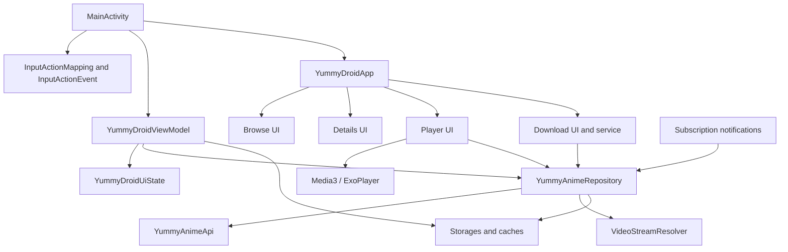
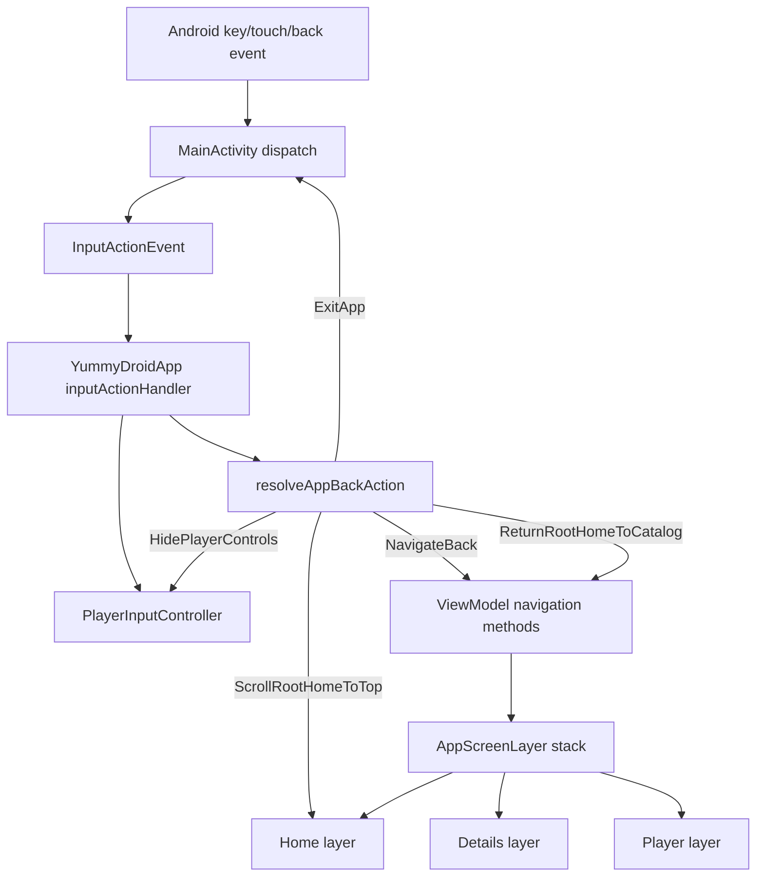
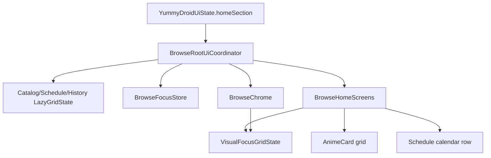
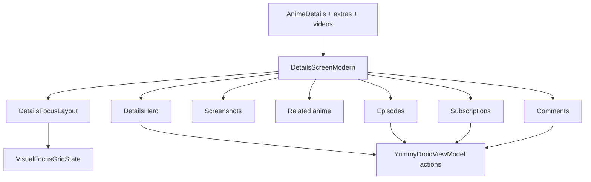
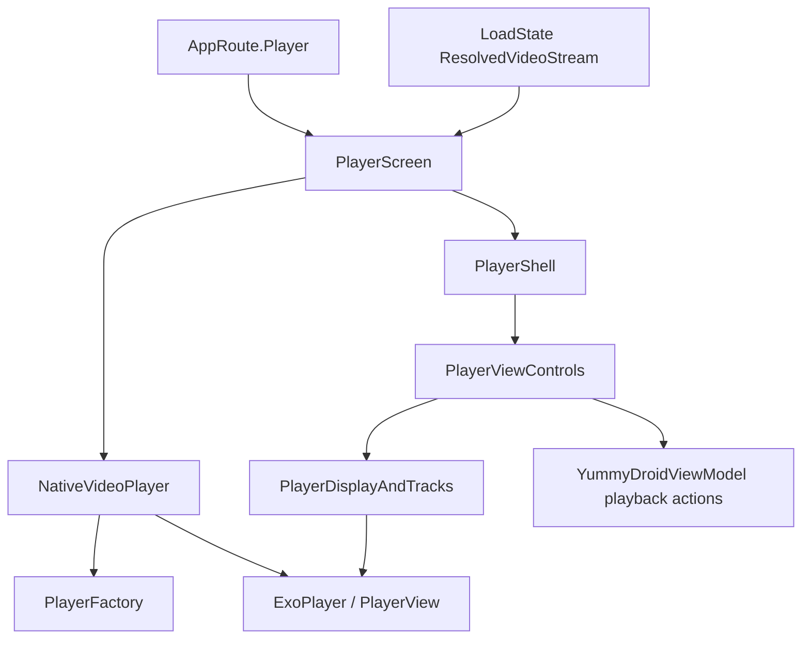
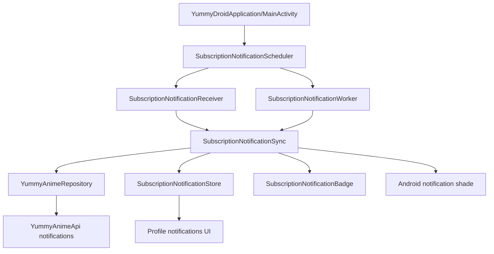

# YummyDroid Refactor Logic Map

Generated during the refactor pass from repowise orientation plus local source inspection.
This file is intentionally behavioral: it maps what must keep working while cleanup,
consolidation, and performance work happens.

## Refactor Rules

1. Preserve observable behavior unless a task explicitly asks to change it.
2. Do not delete Android entry points just because the import graph marks them unused.
   Manifest receivers, services, application classes, FileProvider config, serializers,
   and reflection-loaded classes need runtime evidence before removal.
3. UI changes must go through the shared UI control points instead of adding competing
   per-screen focus, scroll, tab, or back logic.
4. Video availability, voice/source/quality selection, subtitles, playback, and downloads
   must use canonical `/anime/{id}/videos` data and shared matching helpers.
5. Heavy work stays off the main thread. Compose code should render state and dispatch
   events; network, disk, parsing, resolving, and cache calculation belong in data/app
   background boundaries.
6. Player chrome and video playback are separate layers: chrome state should survive
   video source replacement, while the Media3 surface may be recreated when needed.

## Top-Level Module Graph



## App Shell, Layers, and Back



Central owners:
- `MainActivity`: Android event bridge, PiP, system bars, activity intents.
- `YummyDroidApp`: screen layer composition, modal routing, input delegation.
- `AppBackHandling`: pure priority policy for Back.
- `DetailsMediaAndLayers`: layer retention and details screen state.

Refactor boundary:
- Back policy is pure and testable. Keep it in `AppBackHandling`.
- Screen state retention belongs to layer state, not to ad hoc focus restoration.
- Do not add screen-specific Back branches when a shared state predicate can represent it.

## Browse Root UI Graph



Central owners:
- `BrowseRootUiCoordinator`: section grid states, stored focused index, topbar progress.
- `BrowseGridFocusController`: grid focus movement plus scroll positioning.
- `VisualGridNavigation`: visual-direction focus target selection across irregular blocks.
- `BrowseChrome`: root action buttons, tabs, glass/chrome visuals.
- `BrowseHomeScreens`: section content, schedule calendar, paging, dpad hooks.

Known consolidation target:
- Topbar/chrome visibility and protected scroll bounds must be a single contract consumed
  by Catalog, History, and Schedule.
- D-pad fallback focus must use one root recovery path, not per-section fixes.
- Schedule-specific calendar navigation should expose its real visual focus nodes to
  `VisualGridNavigation` instead of bypassing it with competing key logic.

## Details UI Graph



Central owners:
- `DetailsScreenUiState`: retained scroll/expanded/focus state.
- `DetailsFocusLayout`: block offsets and node counts.
- `DetailsHero`, `DetailsSections`, `DetailsMediaAndLayers`: UI blocks.

Refactor boundary:
- Focus block counts must stay consistent with rendered focus items.
- State should stay in the retained details layer when navigating details to details.
- Description counters and API descriptive fields must not be recalculated from videos.

## Player Graph



Central owners:
- `PlayerScreen`: player-level Compose state, loading/error/resume dialogs, retained ready playback.
- `NativeVideoPlayer`: Media3 player/view lifecycle, MediaItem replacement, playback callbacks.
- `PlayerShell`: Android `PlayerView` shell, source labels, subtitle references.
- `PlayerViewControls`: control layout, menus, skip controls, focus.
- `PlayerDisplayAndTracks`: quality/subtitle track extraction and labels.

Refactor boundary:
- Player chrome should not be recreated just because video stream/source changes.
- Menus and buttons must stay visible; disabled state replaces hidden state except PiP support.
- Subtitle labels and subtitle presence must come from actual resolved/media tracks, not guessed
  by provider name.
- Auto fallback must be driven by real playback failure/buffering policy, not source churn.

## Video, Source, Quality, and Downloads

```mermaid
flowchart TD
    DetailsVideos[/anime id videos]
    VideoMatching[VideoMatching]
    DownloadSelection[VideoDownloadSelection]
    DownloadPlan[DownloadPlan]
    Repository[YummyAnimeRepository]
    Resolver[VideoStreamResolver]
    Quality[QualitySelection]
    SourceCache[SourceQualityCacheStorage]
    Player[Player stream]
    DownloadService[DownloadService]
    Offline[OfflineAnimeStorage]

    DetailsVideos --> VideoMatching
    DetailsVideos --> DownloadSelection
    VideoMatching --> DownloadPlan
    DownloadSelection --> DownloadPlan
    DownloadPlan --> DownloadService
    Repository --> Resolver
    Resolver --> Quality
    Resolver --> SourceCache
    Repository --> Player
    Repository --> DownloadService
    DownloadService --> Offline
```

Central owners:
- `VideoMatching`: identity and grouping for episode, voice, player, source.
- `VideoDownloadSelection`: download candidates, voice coverage, known qualities.
- `QualitySelection`: pure preferred-quality selection.
- `DownloadPlan`: user-facing plan construction and validation.
- `YummyAnimeRepository`: orchestration around API, resolver, cache, offline fallback.
- `VideoStreamResolver`: provider-specific URL resolution, manifests, subtitles, qualities.

Refactor boundary:
- Do not duplicate video identity rules in UI, player, and downloads.
- Provider-specific resolver code may be split later, but not before tests cover behavior.
- Alloha remains a high-risk provider path because it depends on WebView document-start
  observation of the real page state.

## Notifications



Refactor boundary:
- Receiver/worker classes are manifest/runtime entry points.
- Badge count and profile notification history must share one unread source of truth.
- Background periodic check and alarm fallback must be treated as runtime behavior, not dead code.

## Cache and Storage Graph

```mermaid
flowchart TD
    Repo[YummyAnimeRepository]
    Settings[AppSettingsStorage]
    Auth[AuthStorage]
    Progress[PlaybackProgressStorage]
    HistoryCache[HistoryAnimeCacheStorage]
    ContentCache[AnimeContentCacheStorage]
    SourceQuality[SourceQualityCacheStorage]
    Offline[OfflineAnimeStorage]
    SearchHistory[SearchHistoryStorage]
    SubHints[VideoSubscriptionHintStorage]
    Rating[AnimeRatingStateStorage]
    ImageCache[Coil image cache]

    Repo --> ContentCache
    Repo --> SourceQuality
    Repo --> Offline
    Repo --> Auth
    Repo --> Progress
    Repo --> HistoryCache
    Repo --> ImageCache
    YummyDroidViewModel --> Settings
    YummyDroidViewModel --> SearchHistory
    YummyDroidViewModel --> SubHints
    YummyDroidViewModel --> Rating
```



Cache policy:
- Image cache can be long-lived and memory-backed for browse card thumbnails.
- Text/API cache should be short-lived and invalidated by language/auth/filter context.
- Offline storage is user data, not disposable cache.
- App cache size must count only content intended by the settings UI; runtime/internal caches
  should be named explicitly if included.

## Risk Register

1. Critical, data/video: `VideoStreamResolver`, `VideoMatching`,
   `VideoDownloadSelection`, `QualitySelection`.
   Risk: source availability, Alloha page-state observation, embedded subtitles,
   provider quality maps, and download/player parity can regress if rules are duplicated
   or provider paths are split without per-provider tests.
2. Critical, UI/focus/chrome: `BrowseRootUiCoordinator`, `BrowseGridFocusController`,
   `VisualGridNavigation`, `BrowseChrome`, `BrowseHomeScreens`.
   Risk: competing focus, scroll, tab, calendar, and chrome logic causes visible jumps,
   lost focus, or D-pad dead ends. Consolidation must happen through shared contracts.
3. High, player UI/lifecycle: `PlayerScreen`, `NativeVideoPlayer`, `PlayerShell`,
   `PlayerViewControls`, `PlayerDisplayAndTracks`.
   Risk: recreating chrome with video state, fallback churn, hidden-but-focusable controls,
   and guessed subtitles can break playback UX.
4. High, app state orchestration: `YummyDroidViewModel`, `YummyDroidUiState`,
   `DetailsMediaAndLayers`.
   Risk: navigation stack, retained details layers, filters, subscriptions, notifications,
   downloads, and playback share one state owner. Only pure extractions are safe without
   broader tests.
5. Medium, downloads/offline/cache: `DownloadPlan`, `DownloadService`,
   `DownloadCenter`, `OfflineAnimeStorage`, cache storages.
   Risk: changing storage keys can orphan files, and cache-size semantics can drift from
   what the settings UI promises.
6. Medium, notifications/runtime entry points: `SubscriptionNotificationReceiver`,
   `SubscriptionNotificationWorker`, `SubscriptionNotificationRescheduleReceiver`,
   `SubscriptionNotificationSync`, `SubscriptionNotificationStore`.
   Risk: Android runtime entry points look unused to static import graphs, but deleting or
   renaming them breaks background checks, badges, and notification intents.

## Initial Safe Refactor Candidates

1. Done, low risk: duplicate app/offline file-size helpers were replaced with
   `File.totalSizeBytes()`.
2. Done, low risk: duplicate `AnimeDetails`/`PlaybackProgress` summary mapping was replaced
   with shared data-layer mapping.
3. Done, medium risk: playback capture DTOs were moved out of `VideoStreamResolver`, while
   provider-specific resolve flow stayed in place.
4. Done, medium risk: visual focus geometry/scoring was moved out of `VisualGridNavigation`,
   while Compose state/modifier ownership stayed there.
5. Done, medium risk: browse action-button focus wiring now uses one `BrowseActionFocusLinks`
   contract instead of repeating six focus parameters per button.
6. Done, medium risk: player popup menus now use one checkable-item builder for source,
   quality, subtitles, and speed.
7. Done, medium risk: player playback duration and buffer-end fallback policy were moved
   out of `NativeVideoPlayer`, while Media3 player/view lifecycle stayed unchanged.
8. Deferred, high risk: large `VideoStreamResolver` provider split. Do it only with
   per-provider tests covering Alloha, CVH, Kodik, subtitles, quality maps, and manifests.
9. Deferred, high risk: `YummyDroidViewModel` state-machine split. Do only behavior-preserving
   extraction behind tests and after mapping each state mutation path.
10. Deferred, high risk: `NativeVideoPlayer` lifecycle split. Do not touch Media3 player/view
   replacement logic without runtime playback checks.

## Verification Matrix

Unit tests:
- App back policy.
- Input action mapping.
- Visual grid navigation.
- Schedule calendar navigation.
- Player focus/source/subtitle/skip behavior.
- Download plan and source matching.
- Data quality/subtitle/video matching/storage tests.

Runtime checks on VM only unless explicitly requested otherwise:
- Phone emulator: touch catalog/history/schedule/details/player.
- TV emulator: D-pad catalog/history/schedule/details/player.
- Player: source, voice, quality, subtitles, skip controls, Back.
- Downloads: plan wizard, queue, pause/resume/delete.
- Notifications: profile history, unread badge, shade intent.
